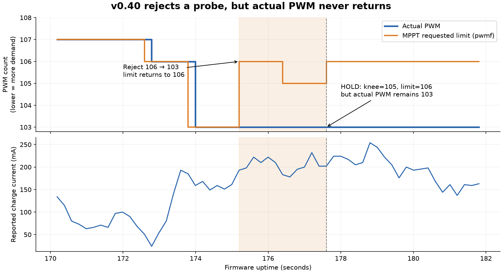

**MPPT investigation — 14 September 2026**

The three reported symptoms have connected causes: protective backoffs can
provoke a reverse-current shutdown; recovery resets the physical operating
point; and the tracker can declare convergence without applying or even
measuring the point it claims to have selected. The v0.40 rewrite retains
these problems and introduces a clear mismatch between its requested PWM
limit and the charger actuator.

This is a diagnosis. No firmware was modified or flashed. Source references
below refer to the working v0.40 tree unless explicitly marked historical.

**Versions and evidence**

`main` is at `471de05` (v0.38). The working tree has uncommitted v0.39/v0.40
changes and a v0.40 banner. `12c5be3` contains v0.36;
`bench/fast-panel-vloop` / `e847a03` contains v0.37-FASTVLOOP. Exact v0.33,
v0.34 and v0.39 source snapshots are not present in reachable commits.
Their observed behavior is established by logs; historical implementation
details must not be treated as independently verified merely because the
changelog describes them.

| Capture | Version evidence | Relevant observations |
|---|---|---|
| `serial_20260910_174314.log` | v0.33 banner, line 3 | Eight reverse-fault episodes, about 80 seconds disabled; six raw collapse traces. |
| `serial_20260910_180041.log` | v0.34 banner, line 3 | 468 visible reverse-fault rising edges. |
| `serial_20260914_085920.log` | Headerless continuation of the second v0.36 boot in `085446` | 27 reverse-fault episodes, about 270 seconds disabled. |
| `serial_20260914_092508.log` | v0.37-FASTVLOOP banner, line 3 | Eleven reverse-fault episodes. |
| `serial_20260914_093947.log` | v0.39 banners, lines 3 and 2372 | Two separate boots; hard standdowns also occur with `dips:0`. |
| `serial_20260914_095416.log` | Headerless continuation of the second v0.39 boot in `093947` | Five hard standdowns and two reverse-fault episodes. |
| `serial_20260914_110639.log` | v0.40 banner, line 3 | Six reverse-fault episodes, about 60 seconds disabled; 25 droop events, no INTRACE, `dips:0`. |

The latest file was growing during review. Counts use a frozen copy ending
at uptime **2051.641 s**, original line **10310**, 3,833,812 bytes, SHA-256
`43e1811bfffd4d660e49d94d53974896ed685db84fae21a7d4f3d44060eb4359`.
Snapshots are in `/tmp/spc20-mppt-review`. Times below are firmware uptime.
The two September 14 headerless continuations match the preceding capture's
uptime and telemetry; their version attribution is inferred from continuity.

**1. v0.40 does not physically undo rejected probes — confirmed in code and log.**

Lower PWM count requests more demand. MPPT now treats `cliff_pwm_min`
(`pwmf` in telemetry) as its actuator. After rejecting a coarse probe,
[mppt.c](../mppt.c) line 552 restores that variable to `probe_from_pwm`.
After rejecting a fine probe, `knee_learn()` raises it above the bad count.
Neither operation restores the actual PWM.

In [charger.c](../charger.c), `pwm_draw_more()` lines 115–124 returns
unchanged whenever actual PWM is already at or below the floor. This was
written for a limit that only blocks further increases in demand. It cannot
implement v0.40's new use of that limit as an operating-point command.

The tracker compounds this at `mppt.c:459`: `pwm <= cliff_pwm_min` counts
as arrival, including an actuator still beyond the requested limit. HOLD
then sets its voltage reference to the rejected operating point.

The v0.40 log shows the entire sequence without any intervening droop:

| Original line | Uptime (s) | Actual PWM | Requested limit | Action |
|---:|---:|---:|---:|---|
| 880 | 173.792 | 106 | 103 | Request coarse probe. |
| 881 | 173.992 | 103 | 103 | Probe applied. |
| 887 | 175.197 | 103 | 106 | Reject probe; actual PWM does not return. |
| 893 | 176.398 | 103 | 105 | Nominal fine probe; actual PWM still unchanged. |
| 900 | 177.602 | 103 | 106 | Enter HOLD and report `knee:105`. |



That knee was inferred from comparisons at the same physical PWM. In the
snapshot, **3319 of 9825 complete CC samples with an active floor (33.8%)**
have actual PWM below the requested floor. One such interval lasts
121.099 seconds, lines 4614–5219. This explains both continued operation
past a rejected point and failure to reuse an accepted point.

**2. Reverse-current recovery is incomplete and inconsistent between guards.**

The old input guard backs off demand and sets `input_rescue_ms`
(`charger.c:290`). The reverse-current guard yields for 200 ms based on
that timestamp (`charger.c:572`). However, input-voltage recovery clears
the input guard's counter and returns (`charger.c:259`); it does not
verify that current has returned to forward flow. The reverse guard's
blanking branch also just returns. Restoration is left to the slower
regulator, whose reverse escape is behind its 400 ms pacing gate and uses
the 64-sample current average (`charger.c:912`, `933`). A voltage recovery
is therefore not necessarily a completed current recovery.

In v0.33, log lines 234–241 show raw panel voltage falling through
`11901 → 6483 → 3494 mV`, a `RECOVERED pwm:95->115` trace, then
`fault:0100`. Panel voltage is already back to 13.065 V at 46.744 s,
but the charger cannot restart until approximately 56 s. Six of that
capture's eight reverse faults accompany its six collapse traces.

The new droop guard has a further omission: it changes PWM at
`charger.c:493` but never sets the recovery timestamp. Its induced
transient is immediately eligible for normal reverse-fault classification.
Four of v0.40's six reverse faults follow droop backoffs:

| Droop action | Charger OFF | Log lines |
|---|---|---|
| 51.369 s, PWM 106→110 | 51.482 s | 262–265 |
| 214.279/214.479 s, PWM 103→107→111 | 214.642 s | 1072–1075 |
| 330.669 s, PWM 108→112 | 331.635 s | 1660–1666 |
| 530.079 s, PWM 108→112 | 530.794 s | 2671–2677 |

The guard tests raw `Ichg + Idsg < -100 mA` on three observed conversions.
These raw currents are not logged, and reported charge current becomes
zero when Q49 opens. Thus positive averaged telemetry before shutdown
does not prove a false latch. Some events may be real reverse current
induced by the backoff; others may involve noise near zero delivery.
The logs do not separate those possibilities.

**3. Reconnection can invalidate its own voltage interlock.**

`tick_buck_settle()` verifies raw VCHG above the battery at the existing
PWM (`charger.c:1128–1149`), closes Q49 at line 1151, then raises PWM to
the learned limit at lines 1173–1175. It does not validate the rail at
that new command. On this converter, reducing demand far enough can
command reverse current; the comment that the change is necessarily safe
because it only reduces current is not a valid interlock.

The v0.40 log shows SETL at PWM108 with limit110 at 540.879 s (line 2728),
CC with PWM110 at 541.082 s (line 2730), averaged charge current −9 mA at
541.483 s, then another reverse shutdown at 541.681 s, with no new droop.
The 150 ms connection blank expires before the regulator's first allowed
400 ms correction. Extending blanking alone would not resolve the changed
command or guarantee forward current.

**4. The supposedly fast protection can miss the collapse precursor.**

The guards run in the foreground (`main.c:1123–1134`), while
`send_string()` calls blocking UART transmission (`SPCBoardAPI.c:1688`).
Telemetry is emitted from the same foreground (`main.c:1216`). At the
configured 115200 baud, a typical 373-character line occupies roughly
32 ms on the wire, plus formatting and other event messages. FIFO buffering
can shorten the CPU wait slightly; it does not make this nonblocking.

ADC acquisition continues every 10 ms in SysTick. The guard sees the latest
sample after UART returns; it does not replay missed conversions. Therefore
the protection has no guaranteed 10 ms response, and its debounce is not
guaranteed to inspect three consecutive conversions. The logs contain
collapses with only one or two precursor samples. Raising the trip voltage
cannot recover a precursor that the control loop never inspected.

**5. Dwell, convergence and memory do not establish a reusable best point.**

The following are separate from the rollback defect:

- At `mppt.c:462`, the 800 ms settling period starts at the request, not
  at physical arrival. An acquisition step can take multiple 400 ms
  regulator updates. When it finally arrives, measurement can begin at
  once, with old operating points still inside the 640 ms ADC window.
  The eight-second fallback even permits measurement without arrival.
- A delta no greater than 15 mA can be labeled a knee (`mppt.c:527–572`).
  There is no requirement that the actuator changed during the measured
  interval, no noise-confidence test, and no explicit rejection of a
  battery-limited/non-arrived comparison. Those omissions can turn an
  unchanged or unsettled point into a persistent limit.
- Current v0.40's 75-second cap enters HOLD at the current trial
  (`mppt.c:701–704`), without restoring an accepted best point. Committed
  v0.38 does the same at its timeout (`git show 471de05:mppt.c`, lines
  751–754). That version also starts a new trial in its flat-response
  branch before checking convergence (lines 598–605). HOLD is therefore
  not proof that the chosen point was measured or was best.
- v0.40's HOLD copies each individually in-band voltage reading into its
  setpoint before regulation (`mppt.c:724–728`). A gradual sag can keep
  moving the reference downward and leave zero error. The droop reference
  can also follow gradual falls (`charger.c:411–414`). This does not
  implement the gradual-sag protection described by the comments.

Older logs additionally show the learned limits excluding useful operating
points. In v0.33, average panel power is 2.026 W at PWM95 during 30–45 s;
after repeated faults the charger holds PWM107 for 156 seconds, then
PWM109 for 349 seconds. In the v0.39 continuation, a reported 4.938 W
at 463.310 s is followed 115 ms later by a hard standdown with raw panel
voltage at 3.571 V (lines 308–312). Later, during 1000–1280 s, CC averages
1.723 W with floor94–95, mostly PWM99, and setpoint around 12.66 V.

These observations show repeated overload/recovery and constrained
operation. They do not establish a global MPP or equal irradiance across
the compared windows. In the preserved v0.38 code, collapse learning
ratchets both a voltage floor and a PWM floor, while only the PWM floor
relaxes slowly. Clamped probes count toward convergence. Thus preserved
memory can also prevent returning to an earlier useful point.

Short outages do not necessarily erase all MPPT memory in recent versions:
`enter_disabled()` preserves it, and re-entry uses a warm path unless sun
was lost, the outage exceeded 60 seconds, or Voc is not credible. But
reconnection still prepositions the actuator through the LUT/SETL sequence;
its warm advance is capped at ten counts (`energy_mode.c:164–207`).
Preserving a setpoint or limit alone does not preserve physical delivery.

**Validation and correction priorities**

A host reproduction in `/tmp/spc20_mppt_review/reproduce.c` includes the
actual MPPT source and verbatim charger PWM helpers/regulator. Clock,
deadband, gain observation and step selection are stubbed. It compiled
with `cc -std=c11 -Wall -Wextra` and reproduced:

```text
Rejected fine probe:   requested return 79, actual PWM stays 78, HOLD
Rejected coarse probe: requested return 79, actual PWM stays 76
Next baseline:         PWM76 accepted as arrived at requested79
Late arrival:          measurement starts immediately on arrival
Gradual HOLD sag:      12.0→10.8 V in 6 s, setpoint follows, PWM unchanged
```

These are control-logic reproductions, not electrical simulations or proof
of a hardware fix. The supplied plot tool was also run on the v0.33 log;
its full chart is `/tmp/spc20-mppt-review/v033.png`.

The correction order should be:

1. Define and implement the actuator contract: apply rejected-probe
   rollback physically, subject to current/rail safety. Validate the final
   command before connecting Q49; handle incompatible limits explicitly.
2. Use a bounded recovery state shared by droop, input collapse and
   reverse-current handling. Verify forward recovery rather than merely
   waiting out a blank. Preserve isolation for persistent reversal.
3. Remove blocking logging from the protection latency path. Record raw
   voltage/current, PWM, sample sequence and recovery reason at events.
4. Start dwell settling after actual arrival and the last interfering
   action; reject capped, moving or contaminated measurements. Restore
   a measured accepted point on rejection and search termination.
5. Revisit limit learning, release and gradual-sag handling only after
   those invariants hold. Retest with real panel/load changes.

Finally, `drp` counts the first attempted droop backoff, not a verified
rescue (`charger.c:499`). `dips` counts input recoveries, not every hard
standdown. Consequently **rising `drp` with flat `dips` is not evidence
that collapses or shutdowns were eliminated**, despite the current
telemetry comments. The six v0.40 reverse shutdowns demonstrate that gap.
